### Zebra-RFID_123RFID-Desktop-do-not-Dicover-Readers_Win11
## 123RFID Desktop for Windows 利用時にRFDリーダが表示されない場合の対処方法
## (Windows 11版 )

</br>

123RFID Desktopの「Find Readers」機能でRFDリーダーを認識できないケースがあります。その場合、下記の手順で解消するかお試し下さい。

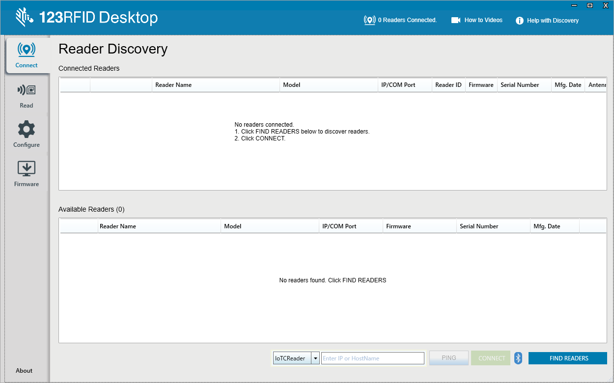

</br>

### 想定される原因

Windowsのシステム言語が「英語」ではない。

### 解消方法

Windowsのシステム言語を「英語」に変更する。


</br>

### 手順

**注意：設定には管理者権限が必要な場合があります。**  
**注意：設定中にサインアウトや再起動が必要になります。**  
**注意：本手順よりサインイン画面が英語表記に変わります。**  


1. 下記設定画面を開きます。  
    スタート⇒設定⇒時刻と言語⇒言語と地域

    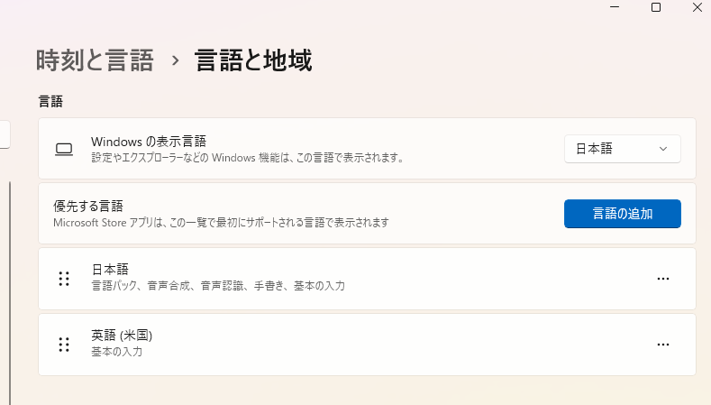

    </br>

1. 下記を選択します。  
    優先する言語 > 言語の追加

1. 下記を選択します。
    "English(米国)"　> 次へ

    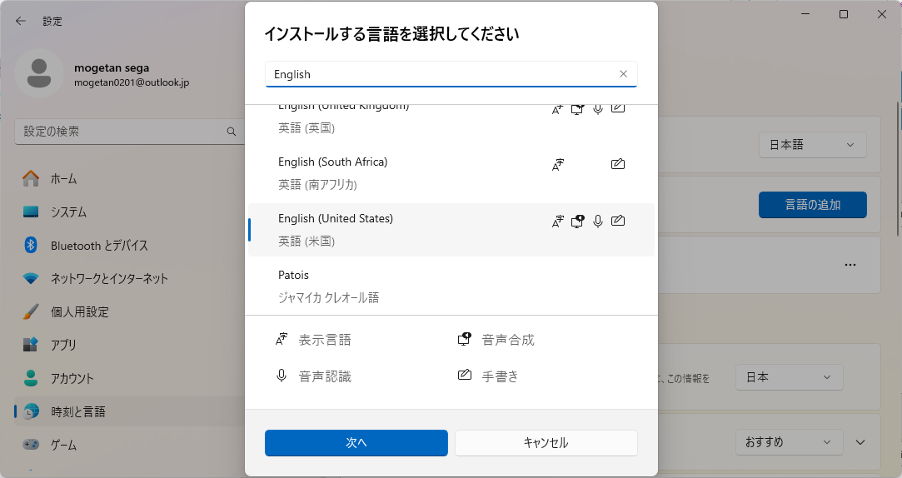

    </br>

1. 下記を選択します。
    - 言語パック
    - 自分のWindowsの表示言語として設定する
    
    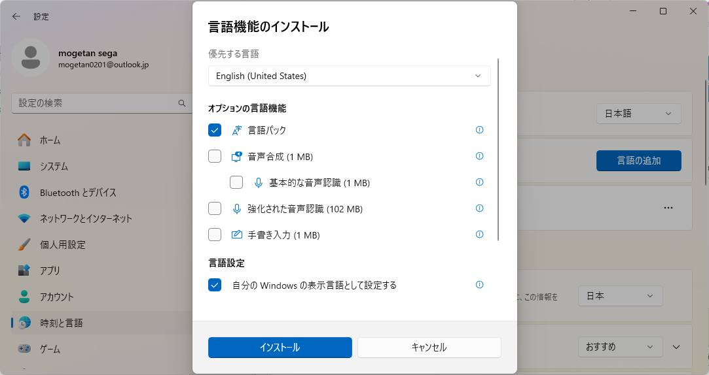

    </br>
    
1. 下記を選択します。
    - インストール

1. 言語パックのダウンロードとインストールの終了まで待ちます。
    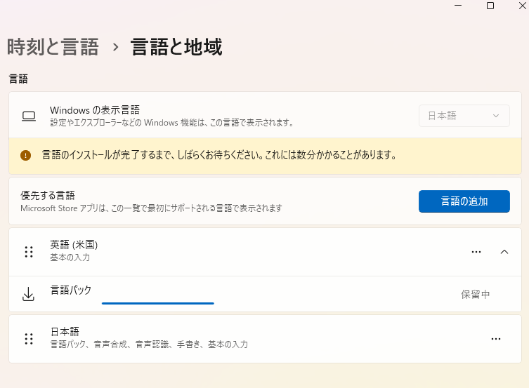

    </br>
    
1. 下記を選択します。
    - サインアウト
    
    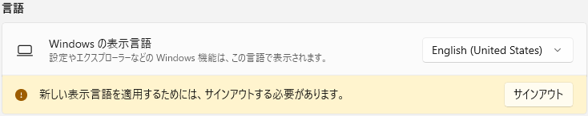

    </br>
    

1. 下記設定画面を開きます。  
    スタート⇒Settings⇒時刻と言語⇒言語と地域⇒管理用の言語の設定

1. 下記を選択します。
    - Copy Settings

    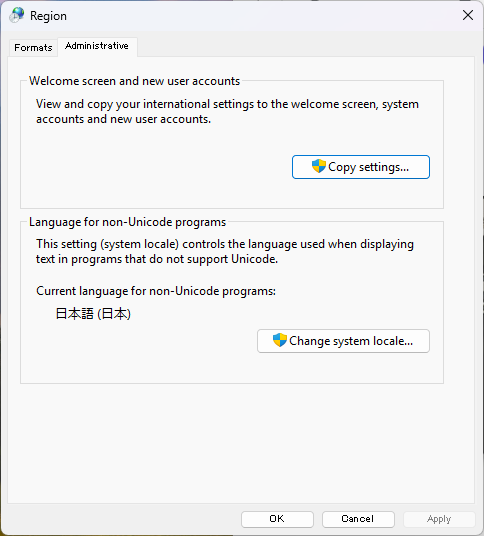

    </br>
    
1. 下記を選択します。
    - Welcome screen and system accounts > OK  

    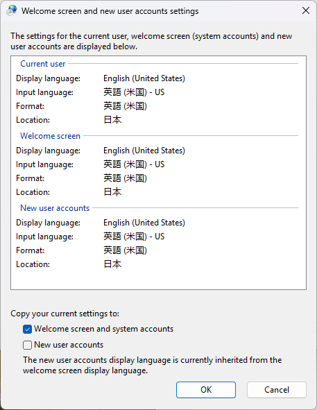

    </br>
    
1. OSを再起動します。

    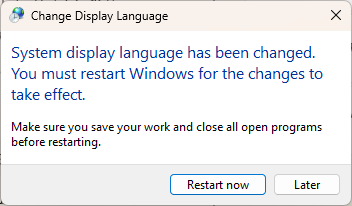

    </br>
    
1. 再起動後に下記設定画面を開きます。  
    スタート⇒Settings⇒時刻と言語⇒言語と地域

1. Windows表示言語を下記に設定し、サインアウトします。
    - 日本語

    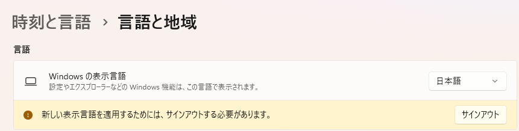

    </br>
    
1. サインインします。

1. デバイス・マネージャを起動します。

1. リーダーをUSB接続します。

1. ポート（COMとLPT）で、RFDリーダのポートを全て削除します。
    - DELETEキーで削除可能

    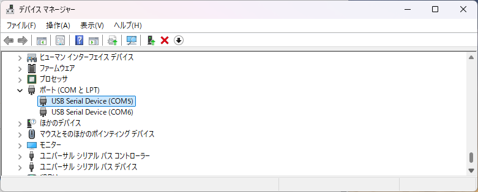

    ```
    ＊注意：
    - 下の図に表示されているポート番号は一例です。ポート番号はお客様の環境により異なります。
    - RFDリーダーのポートを特定できない場合は、 USB のケーブルを抜き、消えるポート番号を選択してください。
    - ポートの数は接続されている RFD40 または RFD90 の種類により、１つまたは２つとなります。
    ```

    </br>
    

1. リーダーをUSBから外し、再接続します。

1. 123RFID DesktopでFIND READERSを選択します。

1. リーダーが認識することを確認します。

    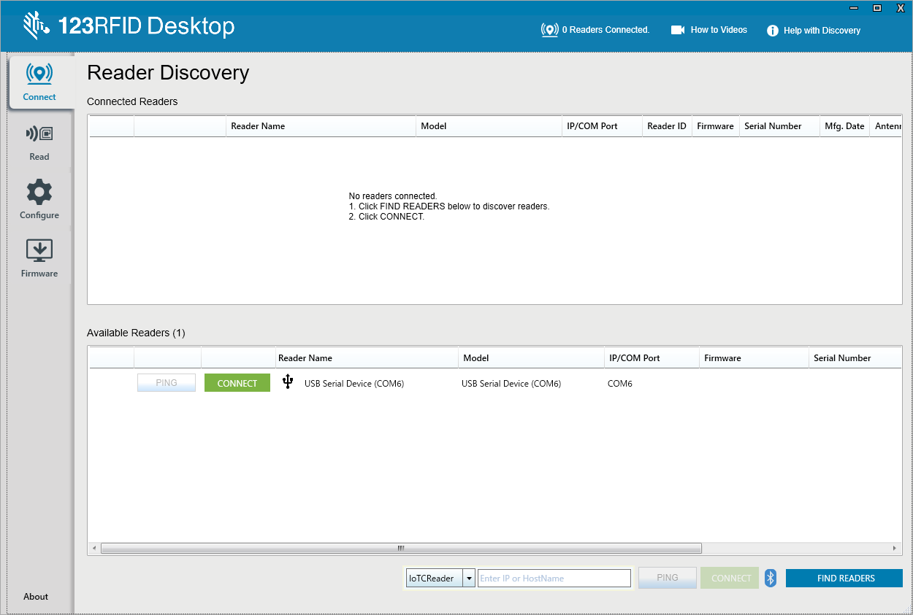
